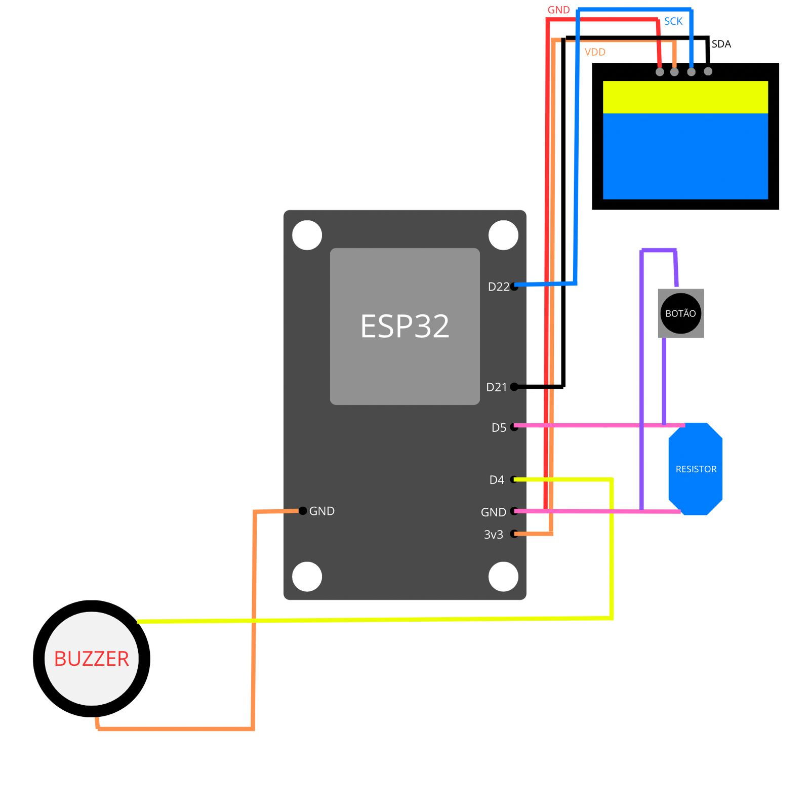

# Despertador Inteligente com ESP32 e Interface Web




## 📝 Descrição
Sistema completo de despertador inteligente com:
- **ESP32** como controlador principal
- **Interface Web** moderna para controle remoto
- Display OLED para visualização local
- Notificações audiovisuais (buzzer + LED)
- Sincronização automática de horário via Internet

## 🌟 Funcionalidades Principais
- ✅ Agendamento de alarmes via interface web
- ✅ Visualização em tempo real no display OLED
- ✅ Cancelamento por botão físico ou pela web
- ✅ Design responsivo para celulares e tablets
- ✅ Sincronização automática de horário (NTP)

## 📦 Componentes Necessários

### Hardware
| Componente          | Quantidade | Observações                     |
|---------------------|------------|----------------------------------|
| ESP32 DevKit        | 1          | Modelo com Wi-Fi integrado       |
| Display OLED I2C    | 1          | 128x64 pixels                   |
| Buzzer ativo        | 1          | 5V com oscilador interno        |
| LED do ESP32        | 1          | Azul + resistor 220Ω            |
| Botão táctil        | 1          | Para cancelamento manual        |
| Protoboard          | 1          | 400 pontos ou similar           |
| Jumpers             | 6          | Macho-macho                     |

### Software
- **ESP32**:
  - Arduino IDE (v2.0+)
  - Bibliotecas:
    - Blynk (para API)
    - Adafruit SSD1306
    - NTPClient

- **Frontend Web**:
  - Navegador moderno (Chrome, Edge, Safari)
  - Conexão com a internet

## 🔌 Conexões do Hardware

| Pino ESP32 | Componente      | Observação               |
|------------|----------------|--------------------------|
| 3V3        | OLED VCC       | Alimentação              |
| GND        | OLED GND       |                          |
| GPIO21     | OLED SDA       | Dados I2C                |
| GPIO22     | OLED SCL       | Clock I2C                |
| GPIO4      | Buzzer (+)     |                          |
| GPIO2      | LED (+)        | Com resistor             |
| GPIO5      | Botão          | Outro terminal no GND    |

## 🚀 Como Configurar

### 1. Programação do ESP32
1. Instale o [Arduino IDE](https://www.arduino.cc/en/software)
2. Adicione suporte ao ESP32:
   ```text
   https://dl.espressif.com/dl/package_esp32_index.json

# Despertador Inteligente com ESP32 e Interface Web

## 📋 Pré-requisitos

### Bibliotecas Necessárias (Instalar via Arduino Library Manager)
- Blynk (v1.0.1)
- Adafruit SSD1306 (v2.5.7)
- Adafruit GFX Library (v1.11.3)
- NTPClient (v3.2.0)

## 🔄 Upload do Código
1. Conecte o ESP32 via USB
2. Selecione:
   - Placa: `ESP32 Dev Module`
   - Porta: `COMx` (identifique a porta correta)
3. Clique em `Upload`

https://sistemas-embarcados-two.vercel.app/

## 🖥️ Manual Rápido

### Adicionar Alarme
1. Selecione o horário no seletor de tempo
2. Insira a descrição (ex: "Paracetamol 500mg")
3. Clique em `Adicionar Alarme`

### Gerenciamento de Alarmes
| Função               | Ação                                                                 |
|----------------------|---------------------------------------------------------------------|
| Visualização         | Lista atualizada em tempo real dos próximos alarmes                 |
| Cancelar Todos       | Remove todos os alarmes agendados                                   |
| Histórico            | Alarmes passados aparecem marcados com ícone ✅                    |

## 🛠️ Troubleshooting

| Sintoma               | Solução                                                                 |
|-----------------------|-------------------------------------------------------------------------|
| Buzzer silencioso     | 1. Verifique conexão no GPIO4<br>2. Confira se é buzzer ativo (5V)     |
| Display inoperante    | 1. Cheque conexões I2C (SDA/SCL)<br>2. Valide endereço 0x3C           |
| Falha de conexão      | 1. Verifique rede Wi-Fi<br>2. Confira se ESP32 está online             |
| Horário incorreto     | 1. Verifique configuração NTP<br>2. Confira fuso horário (-3 para BR)  |

## 🔮 Roadmap
- [ ] Notificações push no navegador
- [ ] Suporte a múltiplos usuários
- [ ] Sincronização com Google Calendar
- [ ] Modo noturno automático

## 🌐 Acesso à Interface Web
Acesse diretamente pelo navegador: 
   ```text
   https://sistemas-embarcados-two.vercel.app/
